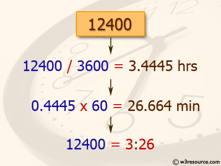

Connected LifeWeb Development (React)Week 1
# Prerequisites
- HTML 5
- CSS
- Basic Programming
# Objective of Course
> *At end of the course student will be able to develop a single page web application using React and any backend Language like firebase, mongo DB.*
# Objective of Week
- Difference between different scripting languages
- Understanding JavaScript Syntax, Variables, Arrays, Functions, Objects, Loops and Conditional Statements.

DOM

When web page loaded browser creates DOM (Document Object Model).

With the object model, JavaScript gets all the power it needs to create dynamic HTML:

- JavaScript can change all the HTML elements in the page
- JavaScript can change all the HTML attributes in the page
- JavaScript can change all the CSS styles in the page
- JavaScript can remove existing HTML elements and attributes
- JavaScript can add new HTML elements and attributes
- JavaScript can react to all existing HTML events in the page
- JavaScript can create new HTML events in the page

DOM is just like a tree 

# What is DOM?
The HTML DOM is a standard **object** model and **programming interface** for HTML. It defines:

- The HTML elements as **objects**
- The **properties** of all HTML elements
- The **methods** to access all HTML elements
- The **events** for all HTML elements

In other words:** The HTML DOM is a standard for how to get, change, add, or delete HTML elements.
# How to work with DOM?
## How to get elements from HTML
We can get element with “id” as well as “class”. In HTML, all elements defines as object.

<html>
<body>

<p id="demo">

</body>
</html>

JavaScript
# What is JavaScript?
*JavaScript is scripting language usually used for front end development but also use for backend (Node.JS)*
> ***HTML is structure of the website like skeleton structure of human body***
>
> ***CSS is for beautifying the HTML structure like good cloths beautify the human body***
>
> ***And JavaScript is to produce behavior in HTML structure like Soul in the body.***

In HTML, JavaScript code is being written in <script> tag.
# Clint-Side Scripting vs Server-Side Scripting

|<h2>Comparison </h2>|<h2>Server-Side Scripting</h2>|<h2>Clint Side Scripting </h2>|
| :- | :- | :- |
|<h3>Basic</h3>|Works at the back end and could not be visible at Clint side|Works at the front end and visible to user|
|<h3>Processing</h3>|Requires Server Interaction |Does not interaction with server|
|<h3>Language Involve </h3>|PHP, Python, ASP.NET|HTML, JavaScript|
|<h3>Affect</h3>|Customize the web page and provide dynamic content|Can reduce the load to server|
|<h3>Security</h3>|Relatively Secure|Insecure|

# Why we use JavaScript in Web development?
JavaScript allows users to interact with web pages. There are almost no limits to the things you can do with JavaScript on a web page – these are just a few examples:

- Show or hide more information with the click of a button
- Change the color of a button when the mouse hovers over it
- Slide through a carousel of images on the homepage
- Zooming in or zooming out on an image
- Displaying a timer or count-down on a website
- Playing audio and video in a web page
- Displaying animations
- Using a drop-down hamburger menu
#
# JavaScript Syntax
## Data Types and Variable Declaration
We use key word “var” for variable declaration. Identifiers are case sensitive.
#### *String*
var lastName = "Johnson";    
#### *Object*
var x = {firstName:"John", lastName:"Doe"};
#### *Number*
var length = 16;
#### *Double*
var x1 = 34.00;
#### *Boolean*
var x = 5;
var y = 5;
var z = 6;
(x == y)      // Returns true
(x == z)      // Returns false
#### *Array*
var cars = ["Saab", "Volvo", "BMW"];
#### *Undefined*
var car;  // Value is undefined, type is undefined
## Operators

|<h2>Operators</h2>|<h2>Description </h2>|
| :- | :- |
|*+*|*Plus*|
|*-*|*Minus* |
|*\**|*Multiplication*|
|*/*|*Division*|
|*%*|*Mode*|
|*++* |*Incremental* |
|*--*|*Decremental*|

##
## Functions in JavaScript
Function is block of code design to perform a particular task.
#### *Syntax of function*
In JavaScript there is no return type of function

function *name* (*parameter1, parameter2, parameter3*) {
`  `// *code to be executed*
}
## Example
A function to print “Hello World” on console.
## Challenge 
Make a function to calculate area of circle using textbox for input.
# Statements
A computer program is a list of "instructions" to be "executed" by a computer. In a programming language, programming instructions are called statements. A JavaScript program is a list of programming statements**.**

In HTML, JavaScript is executed by web browser. Each statement is end with “;” semi colon.
# Conditional Statements
We do very conditional decisions daily like if go to university you get knowledge else you don’t.

How can you convert it into computational problem we use Conditional Statements in programming like if else and switch statements?
### If condition
if (*condition*) {
`  `// *block of code to be executed if the condition is true*
} 
## Example
Make a program which tells student’s grade on basis of its marks

`	`**e.g**

`	`**marks=90**

`	`**if(marks>90)**

`	`**{**

`		`**Console.log(“A grade”)**

**}**

`	`**if(marks>80)**

`	`**{**

`		`**Console.log(“B grade”)**

**}**

**if condition** is not true then **else**

if (*condition*) {
`  `// *block of code to be executed if the condition is true*
} 

else {

` `// *block of code to be executed if the condition is false*

}
## Example
**e.g**

**temp=40**

**if(temp>30)**

**{**

`	`**Console.log(“Its hot”);**

**}**

**Else**

**{**

`	`**Console.log(“its cold”);**

**}**
**

### Switch
switch(*expression*) {
`  `case *x*:
`    `*// code block*
`    `break;
`  `case *y*:
`    `*// code block*
`    `break;
`  `default:
`    `// *code block*
}

e.g

month=9

switch(month){

`	`case 9:

`		`console.log(“its october”);

`		`break;

`	`case 10:

`		`console.log(“its novemeber”);

`		`break;

`	`default:

`		`console.log(“please enter a valid  month value”);

}
## Challenge
Make a function get student’s marks as an argument and print his grade. If marks greater or equal than 90, print A+. If marks greater or equal to 80 and less than 90, print A. If marks greater or equal to 70 and less than 80, print B. If marks greater or equal to 60 and less than 70, print C. If marks greater or equal to 60 and less than 70, print D. If marks greater or equal to 50 and less than 60, print E. Otherwise print F.
# Arrays in JavaScript
If you have 10 similar variables you can declare it separately but if you have 10000 similar values how will you store it will you declare 10000 variables?

Do you have any solution in your mind?

We have array in JavaScript

var cars = ["Saab", "Volvo", "BMW"];

We have another syntax 

var cars = new Array ("Saab", "Volvo", "BMW");
# Loops
Loops are used to do something iteratively on the bases of any condition. We have three loops 
### For Loop
for (*statement 1*; *statement 2*; *statement 3*) {
`  `// *code block to be executed*
}

Statement 1 is executed (one time) before the execution of the code block.

Statement 2 defines the condition for executing the code block.

Statement 3 is executed (every time) after the code block has been executed.Example

Get array of Cars Name and show in on the web page.
### While Loop
while (*condition*) {
`  `*// code block to be executed*
}
### Do While 
do {
`  `*// code block to be executed*
}
while (*condition*);
## Example
Print first 10 numbers using while number.
## Challenge
Declare two arrays of Student names and their marks. Print all the students with there marks.

# Objects in JavaScript
If you want to store data of 100 students in class have entities name, registration number, date of birth, and degree. Will you declare 100\*4 variables?

Do you have any solution in your mind?

We have Objects in JavaScript

var student = {name: “Talha", Reg:"2017-CS-112", DOB:"2000/6/24", Degree: “BSCS"};

Lab Tasks
# Task 1.1
Write a JavaScript program to calculate multiplication and division of two numbers (input from user).
# Task 1.2
Write a JavaScript program to convert temperatures to and from Celsius, Fahrenheit.

Home Tasks
# Task 1.1
Write a JavaScript program to check a given string contains 2 to 4 numbers of a specified character. For example checkString(“Hollow”,”o”), Return TRUE.
# Task 1.2
Write a JavaScript program to convert a given number to hours and minutes.

` `PAGE   \\* MERGEFORMAT 2

